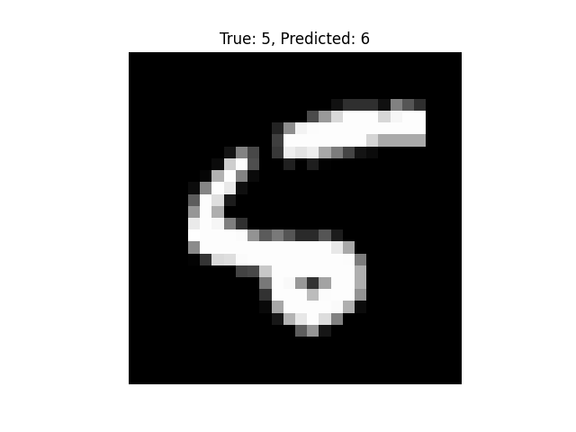

# Neural-Network

This project implements a simple feedforward neural network from scratch using Python and NumPy. It is designed for multi-class classification tasks such as classifying digits.

I have wanted to do this project since learning necessary concepts from multivariate calculus.

## Features

- Two-layer neural network with ReLU activation and softmax output.
- Mini-batch gradient descent training.
- Cross-entropy loss function.
- One-hot encoded labels support.
- Training data shuffling and batching.
- Test accuracy evaluation.
- Visualization tool to display test images with predicted and true labels.

## Usage

1. Train the model using the `train` function with your dataset.
2. Evaluate test accuracy.
3. Visualize predictions on test images with true and predicted labels.

## Example Training Output

Epoch 1/10, Loss: 1.3596

Epoch 2/10, Loss: 0.5443

Epoch 3/10, Loss: 0.4162

Epoch 4/10, Loss: 0.3673

Epoch 5/10, Loss: 0.3394

Epoch 6/10, Loss: 0.3199

Epoch 7/10, Loss: 0.3044

Epoch 8/10, Loss: 0.2916

Epoch 9/10, Loss: 0.2805

Epoch 10/10, Loss: 0.2706

**Test accuracy: 92.74%**

### Misclassified Images

Here is an example of a misclassified image:

